

# 部分 100 分钟建筑赛经验

## 引言

本经验总结是基于我们在六届《100 分钟建筑赛》中全部的情况总结的经验，希望能够给想要举办速建赛的成员一个参考。

下文将以问答的方式来进行经验总结。

首先记住这一点：100分钟建筑赛严格上不是竞赛！不是你死我活的竞赛！

## 为什么要选择 100 分钟？

最早决定使用“100 分钟”是因为一个惯性：Maxkim 的“基姆城”创造服务器第一次举办速建赛的时候使用的就是 100 分钟。时间不长不短，绝对是够了。

就目前已知的“速建赛”而言：

- 针对专业建筑师的 MC 速建赛至少需要 48 小时，时间管够（但相比于一个大型建筑的总建筑时间而言还是短），但是这种比赛基本上没什么娱乐性和“过程观赏性”，门槛过高；
- 短的建筑赛也有 10 分钟~20 分钟的（例如 Rage 的 10 分钟速建赛，Hypixel 的速建赛等），娱乐性足够，但出现高创意度和精致度的建筑概率还是太低了。

所以，最后的时间选择上，还是保留不长不短的 100 分钟：在保证观赏性的同时，也足够让会做建筑的人出一个好建筑了。当然，我们也会酌情根据选题难度将时间限制上升到 120 分钟~150 分钟。

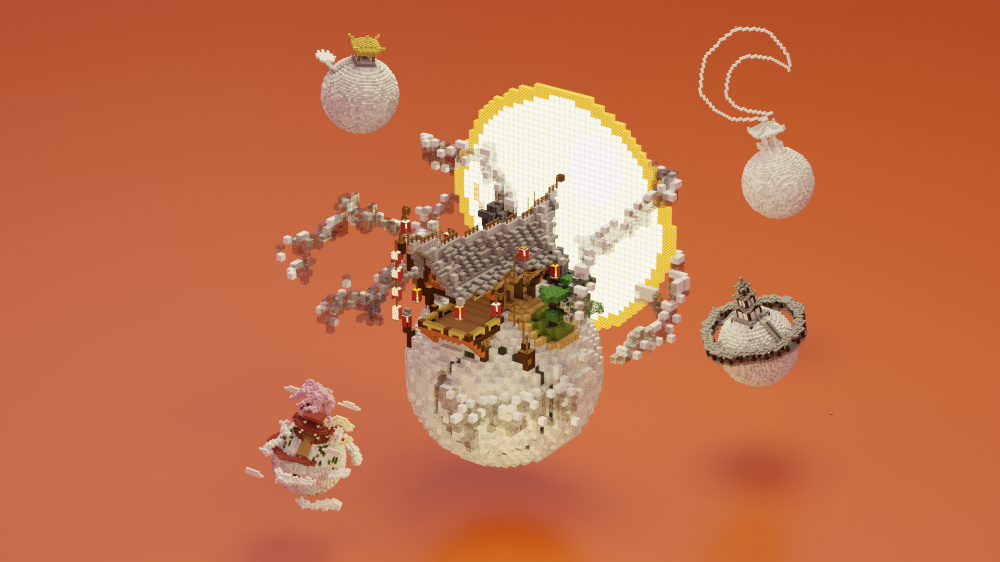

<ImageText>《第五届 100 分钟建筑赛：我的月亮》优胜作品（深圳大学*App1e*制作），旁边的为部分参赛作品</ImageText>

## 要不要允许使用建筑编辑插件/模组/指令？

我们建议不要。

考虑到 100 分钟建筑赛的参与者大多数不是 MC 建筑师，增加建筑编辑插件只会让大佬的水平变得更高，从而导致成绩断层严重，雅俗共赏的建筑赛让大佬纯虐菜那就不好玩了。

可能会有大佬抱怨道“都快要点出腱鞘炎了”，别理就是了，用 we 多了下下基层怎么了。

<TextCard title="📌">

100 分钟建筑赛一大核心目标就是**尽可能地抹平大佬和萌新的水平差异，平衡玩家体验**。这在之后要讲的很多事情中都会体现。

</TextCard>

但仅去禁止世界编辑插件/模组/指令是不能完全抹平水平差异的，只能说尽可能降低，更多的情况下还是需要多方位进行限制，下面会讲。

<TextCard title="📌 例：">

- 《第二届 100 分钟建筑赛：地标》因为只限制了世界编辑能力且并未认真设计赛题，结果第一名和第二名战力水平直接出现了恐怖断层。
- 《清明 100 分钟建筑赛：花解语，鸟自鸣，雨喃呢》也因为如上原因（外加赛题设计过难）导致了出现水平断层和神仙打架。

</TextCard>

## 出什么样的选题呢？

早期的 100 分钟建筑赛选题仍旧是比较“泛”的（第一届《泉》，第二届《地标》），这让每一个人对赛题的理解都会出现极大的扩散性，结果就是做什么的都有。

<TwoColumn>
<template #left>

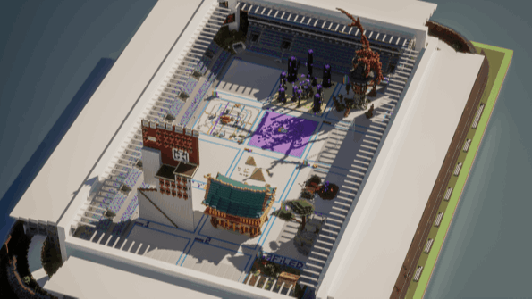

<ImageText>第一届现场</ImageText>

</template>

<template #right>

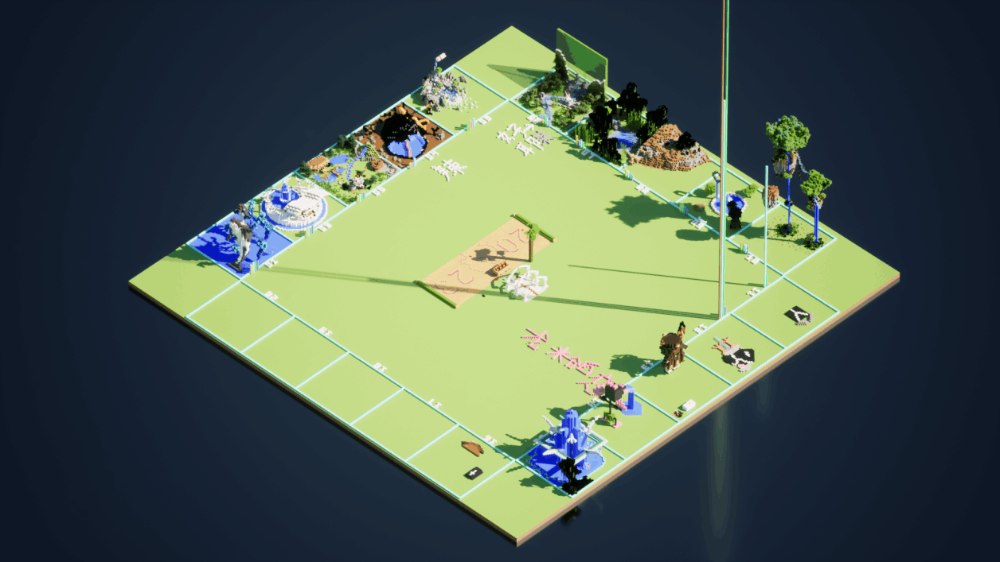

<ImageText>第二届现场</ImageText>

</template>
</TwoColumn>

后来到了第三届 100 分钟建筑赛，《花解语，鸟自鸣，雨喃呢》。赛题倒是很明确了，但是赛题本身太难去理解了（几乎所有人听到这个赛题都蒙了一下），结果就是因为每个人理解力不同，能理解赛题并制作出来的基本上都是前或现建筑佬，萌新几乎无法正常会意并进行建筑，只能疯狂种大树。

<TextCard title="📌">

**《花解语，鸟自鸣，雨喃呢》** 本质上是个很不错的赛题，但是因为会意艰难，且估计并未考虑过预计的最终建筑结果，放在 100 分钟建筑赛中并不合适。

</TextCard>

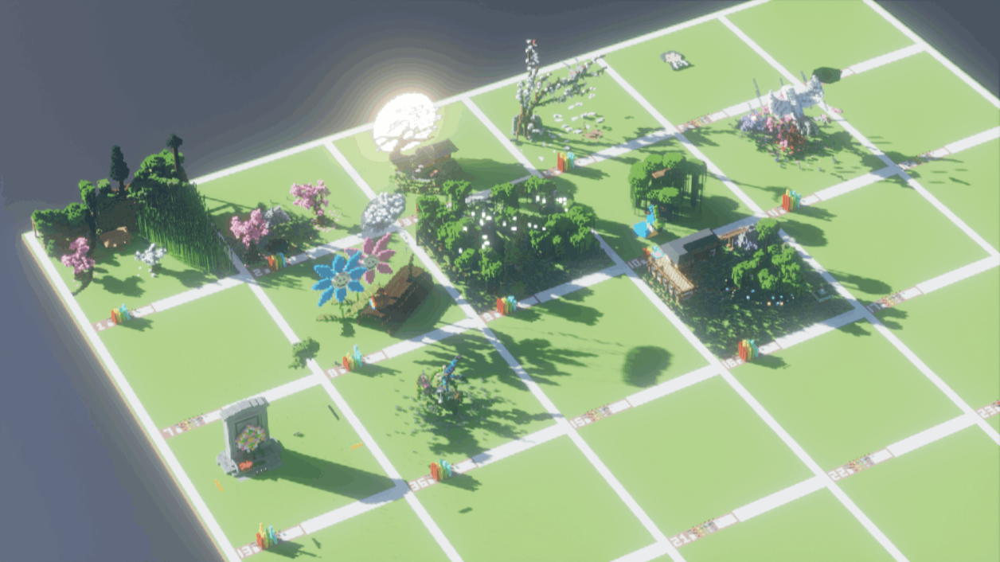

<ImageText>第三届现场</ImageText>

以上例子可以看出“赛题选择”的重要性：这不是说随便摇一个号找个词就完事儿的事情。在 100 分钟建筑赛这个“好玩儿”而不是“竞争”的比赛上，平衡玩家体验也是很重要的。

一般选赛题的时候，我们会在这几个维度上考虑：

- **这个赛题“泛”吗？**：过于宽泛的赛题可能会导致每位玩家对赛题的理解过于不同，这可能导致建筑结果断层（第二届），评委无法根据赛题评分（第一届），可能的抄袭现象（第一届）等。
- **这个赛题难以理解吗？**：过于难以理解的赛题也会导致玩家的理解不够深刻，从而导致跑题，建筑结果断层（第三届）等情况。
- **这个赛题预计的建筑结果会非常复杂/简单吗？**：出赛题的时候记得要思考：“如果是我我会怎样打草稿……”并给出一个评级。如果一个赛题的预计建筑结果过于复杂精妙。可能会导致跑题（第三届），和建筑结果断层（第三届）的情况。100 分钟建筑赛的预计建筑结果最好还是越简单越好，这样更容易出创意。

<TextCard title="📌">

我们曾经考虑过《呼之欲出的 3D 框景》这个赛题，但是考虑到这类赛题无论比例大小规则如何都需要较为精妙的建筑手段和构图把控，遂决定放弃。

</TextCard>

- **这个赛题有趣吗？**：这个很好理解，有趣的赛题自然有意思，大伙也爱看。

考虑这些维度之后，第三届以后的 100 分钟建筑赛选题便逐渐开始变的有很强的指向性，易于理解，建筑简单且异常有趣。或者说正在朝着“趣味游戏”的方向发展。

《第四届 100 分钟建筑赛》别出心裁地将比赛场地设置成了玩偶屋，要求也很简单：“每个人至少需要填满玩偶屋的两个格子。”每个玩偶屋的格子并不大，易于建筑且非常有趣。而且最后组合出来的结果相性很好，可谓是：“大家一起搭建出的完整建筑作品”。

自此之后，100 分钟建筑赛的赛题就从来没再无趣过。

<TextCard title="📌">

第四届的赛题其实很“泛”，似乎违反了上述的第一条准则，但是这实际上是故意放开的，反而能激发出更多有趣的想法，所以不要限制太死。

</TextCard>

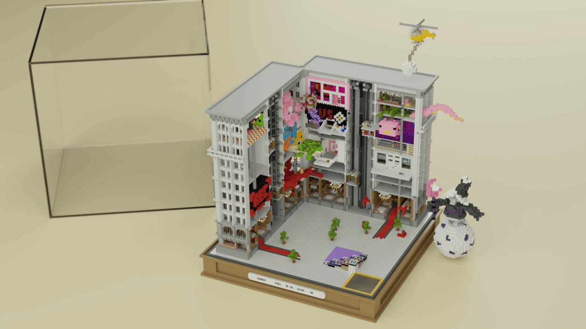

<ImageText>第四届现场</ImageText>

## 怎么设计场地？

前三届 100 分钟建筑赛是矩形用地：第一届是 50*50，第二届 40*40，第三届更是达到了 73\*73。对于 100 分钟建筑赛而言，个人认为 40~50 见方就已经足够了。原因仍旧是老生常谈的：“要给萌新平衡性”。

<TextCard title="📌">

虽然“用地大小”只是个限制而已，并不影响评分，但建筑场地里总会有几个作品无论如何硬是要把地皮占满，原因未知。

</TextCard>

<TwoColumn>
<template #left>

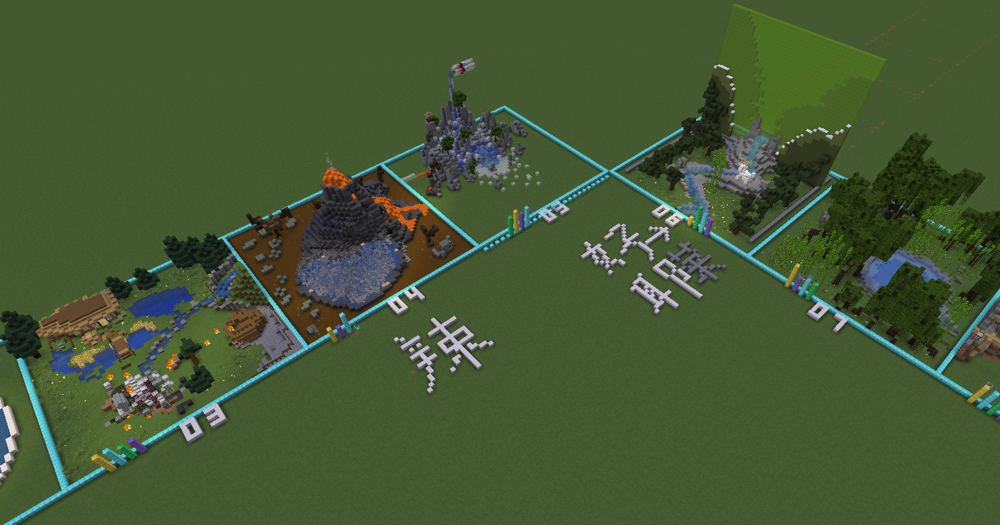

<ImageText>第一届现场，3 号，4 号，6 号，7 号全占满了地。</ImageText>

</template>

<template #right>

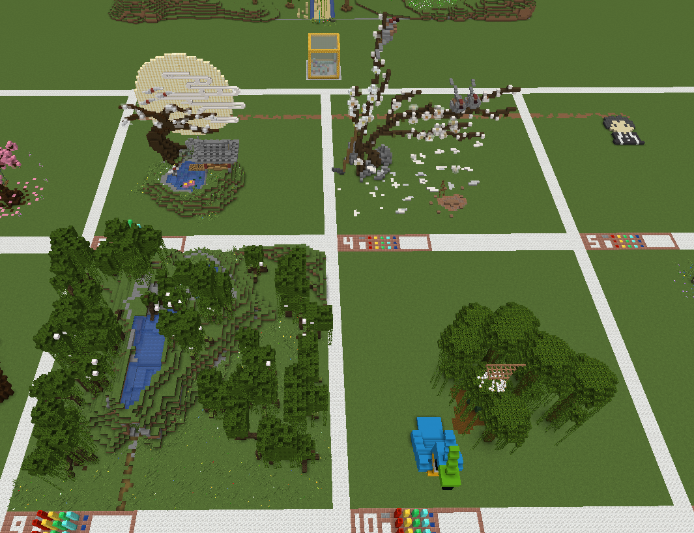

<ImageText>第三届现场，9 号占满了用地，而优胜作品和亚军作品实际上并未在意用地大小的问题。</ImageText>

</template>
</TwoColumn>

有些时候也并不一定只需要传统的用地来举行 100 分钟建筑赛：第四届 100 分钟建筑赛开始，建筑用地就开始逐渐转向“有趣”的方向，也会根据赛题来规定不同种类的用地了！

更有趣的用地也能抵消一部分 MC 建筑所带来的天生严肃性，也能足够简单扼要地指明玩家制作的大方向，评委也更容易针对性地进行打分，双赢。

<TextCard title="📌 例：">

- 第四届主题是“塞满玩偶屋”，所以用“玩偶屋”作为建筑用地，
- 第五届（中秋建筑赛）主题为“我的月亮”，所以每个人都要在一个小“月球”上制作建筑。
- 第六届（2024 小年）主题为“我中意的年夜饭”，那建筑场地自然是餐桌上的餐盘了！

</TextCard>

<TwoColumn>
<template #left>

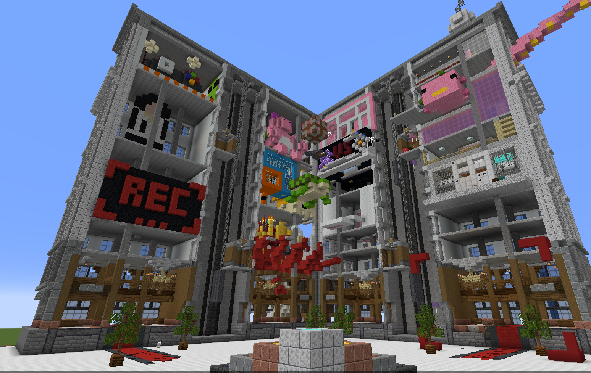

<ImageText>第四届现场</ImageText>

</template>

<template #right>

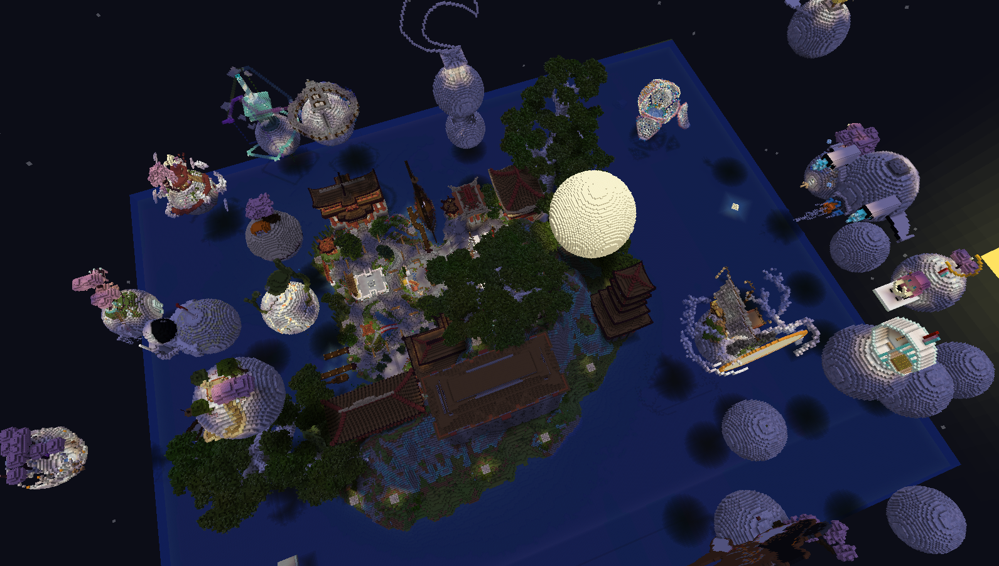

<ImageText>第五届现场</ImageText>

</template>
</TwoColumn>

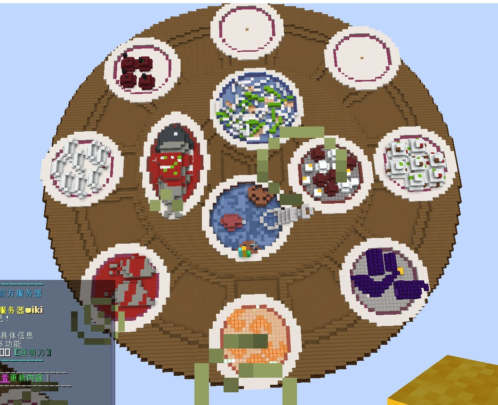

<ImageText>第六届现场（其中一名玩家的用地）</ImageText>

<TextCard title="📌">

“在用地上做创意文章”的灵感也是基于电视节目《乐高大师》的特色赛制而来的。

</TextCard>

## 怎么确定抄袭？

记得在开赛后到每一个用地里去逛一逛，去看一下玩家是怎么做建筑的。一般情况下做建筑会遵循一个基本逻辑，而行为异常的多半是在抄袭（比如打开了投影模组）。

玩家在抄袭建筑一般有如下表征：

- 玩家在“一层一层”地，像 3D 打印机那样“铺”建筑：**可能使用了投影模组**。
- 玩家的某个建筑特征和它的其他建筑水平不一致：**水平好的建筑可能涉嫌抄袭**。
- 玩家在本届 100 分钟建筑赛上的建筑水平突飞猛进：**开小灶或本届建筑可能涉及抄袭**。
- 玩家在本届 100 分钟建筑赛的建筑水平较上届有明显下降：**上一届建筑可能涉嫌抄袭**。

<TextCard title="📌">

看起来很离谱吧，来看真实例子吧。

**例：**

《第一届 100 分钟建筑赛》的优胜者，在建筑过程中 **“一层一层”地制作了**下图中最大的虎鲸（涉嫌抄袭 TheYellowVillager ），之后所制作的“小虎鲸”和“水柱”部分**均对不上“大虎鲸”的建筑水平**，且该玩家在第二届 100 分钟建筑赛中**水平明显下降**。于是被评委怀疑抄袭。

第六届 10 分钟建筑赛举办完毕后，该抄袭被实锤，原本的胜者最后获得了惩罚：**自费给下一届 100 分钟建筑赛准备奖品。**

</TextCard>

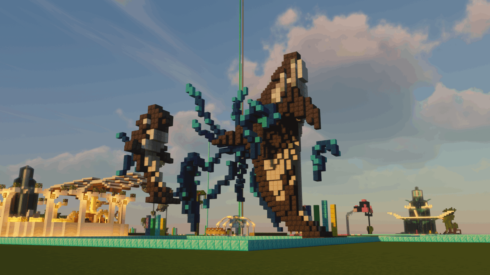

<ImageText>第一届 100 分钟建筑赛优胜作品，后实锤为抄袭 TheYellowVillager 的教程。</ImageText>

## 怎么评分？

我们一般采用四位评委，每人 10 分制，取四个的人的总和或平均值。

建筑的评分会用矿物块堆叠表示，放在建筑用地旁。

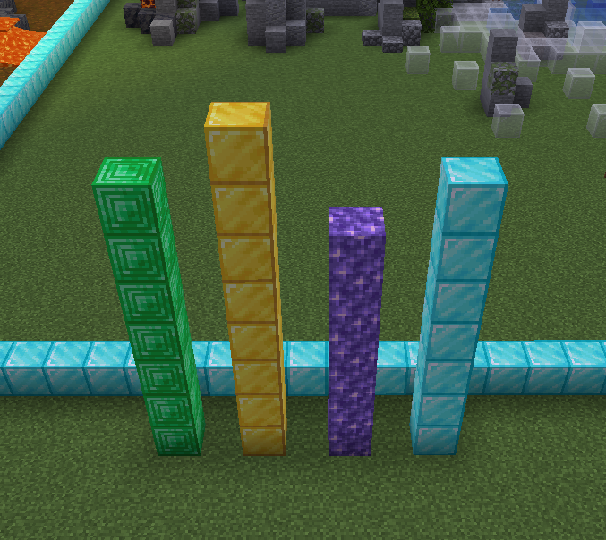

<ImageText>一个打分的例子</ImageText>

**如果可以，四位评委的构成中至少要包含一名 MC 建筑佬**：不是因为他的评价更专业，而是因为他能找到可能的抄袭点或者创意点，从而更精准地控制分数。

本社某一名建筑师的评分倾向更加类似于语文作文的评分，但更加支持创意。构成如下：

0-10 分

<table>
  <thead>
    <tr>
      <th>0分</th><th>1分</th><th>2分</th><th>3分</th><th>4分</th>
      <th>5分</th><th>6分</th><th>7分</th><th>8分</th><th>9分</th><th>10分</th>
    </tr>
  </thead>
  <tbody>
    <tr>
      <td>发现违规/抄袭</td>
      <td colspan="4">一般情况下不打</td>
      <td>跑题</td>
      <td colspan="4">正常看建筑水平打分</td>
      <td>有创意/闪光点</td>
    </tr>
  </tbody>
</table>

第四届 100 分钟建筑赛切换了风格之后，就基本上不打跑题分了，偶尔也会出现想要打 10 分的 SSR（可惜参赛选手不能当评委）。

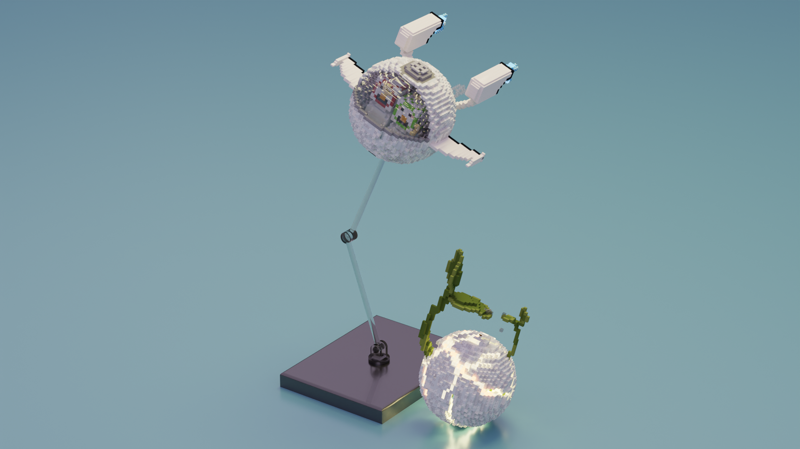

<ImageText>第四届 100 分钟建筑赛切换了风格之后，就基本上不打跑题分了，偶尔也会出现想要打 10 分的 SSR（可惜参赛选手不能当评委）。</ImageText>

有些时候为了增加趣味性和防止可能的不稳定因素（例如不违规的整活类建筑），会引入其他的评分系统，这类附加的评分系统一般被 MC 建筑佬或者足够“稳重”的人把持。

<TextCard title="📌 例：">

《第六届 100 分钟建筑赛》有如下四个评分体系：

- **卖相分**：判定整个宴席的卖相是否足够诱人（实际上就是原先的评分体系除去了创意分，防止黑暗料理截胡冠军）。
- **创意分**：判定宴席中某道菜的创意程度，取最高值（是把创意分拆成了 10 分制系统的产物）。
- **硬菜系数**：判定宴席里非黑暗料理中最“豪横”的菜，根据豪横程度乘以一个系数（1.2~2.0)（新年期间为了添喜气，鼓励大家制作硬菜所引入的加成分）。
- **帮厨系数**：判定宴席里剩多少空盘，根据空盘数乘以一个系数（2.0~1.0）（新年期间为了添喜气，鼓励大家多制作不同的菜肴所引入的加成分）。

</TextCard>

## 有什么约定俗成的规则吗？

100 分钟建筑赛没有纸面上的规则，但有习惯规则。在此列出，供您参考：

1. 比赛前选定一名出题人确定赛题并保密，**开赛前 30 秒公布**。
2. 出题人和事先知道题目的人禁止参赛（第四届违反过一次）。
3. 参赛者不能做评委（第五届违反过一次）。
4. 整活建筑打超 10 分以表尊重，但实际记总分 0 分。
5. 发现抄袭总分 0 分。若冠军在奖品发放后被发现抄袭，下一届建筑赛奖品抄袭的出（第一届发生过一次）。
6. **禁止纯像素画作品，若纯像素画作品出现最高只能打 6 分\***。（第五届发生过一次）

<TextCard title="📌">

\*：纯像素画作品只有一个平面，制作取巧，且极容易抄袭，所以决定直接一刀切。

</TextCard>
