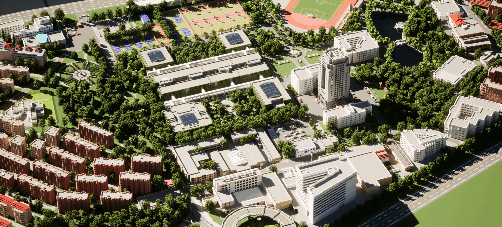

<Hero :image=heroImage class="mb-14">
  

    

      
    

    

      方块虽小， 
      亦是精彩之源。
    

  

</Hero>

## 我社简介

燕山大学Minecraft学生同好者协会（也可以叫燕山大学MC社）成立于2022年9月13日， 
是以游戏《我的世界》（Minecraft）为核心开展同好活动和专业项目的学生社团， 
 
**值得骄傲的是：我们是燕山大学第一个被学校官方承认的游戏社团。**
 
我们致力于为每一位来自燕山大学的Minecraft爱好者提供一个友好的交流平台， 
并向外界展示Minecraft的趣味和价值。

<ImageText align="left">燕山大学复原计划&nbsp;&nbsp;东校区&nbsp;&nbsp;2022.04</ImageText>

<TwoColumn>
<template #left>

## Minecraft是什么？

Minecraft中文译名《我的世界》，是瑞典游戏工作室Mojang
Studio于2009年推出的沙盒类电子游戏。游戏中以“方块”为单位元的建设模式和简便直观的操作手法让这款游戏的受众极为广泛，玩家可以通过游玩培养审美能力和逻辑思维。Minecraft本身也具有半开源性，这也会让玩家体验到诸如编程、网络工程等计算机知识。

</template>
<template #right>

<ImageText align="right">
《流浪地球2》太空电梯 轿厢 复原（1:1） 
秋田同学 2023.3&nbsp;&nbsp;
</ImageText>

</template>
</TwoColumn>

## 趣味与价值

燕山大学Minecraft学生同好者协会虽然是游戏社团，但我们也不仅仅止于游戏的方方面面， 
而是试着走出去，让Minecraft发挥更大的魅力。 
 
**燕山大学Minecraft学生同好者协会的成员们精诚合作，共同创造出趣味与价值并存的成果。** 
 
《像素燕大：燕山大学复原计划》用三千一百万方块详细生动地展现出了燕山大学东西校区的全貌。 
每到佳节便会举办的玩家联谊会让欢笑跨越了距离的隔阂。 
社团内部的三大工作流在为游戏增色的同时，也让社团具备了强大的专业素质。 
 
…… 
 
**游戏带来趣味，项目和专业工作流带来价值，这也是燕山大学Minecraft学生同好者协会一直所坚持的事情。**

<ProjectCard v-for="i in [
  {
    title: '《像素燕大：燕山大学复原计划》',
    image: ProjImg1,
    link: '/project/work/pixel-ysu',
    text: '《像素燕大》:该项目于2022年2月24日着手计划建设，于2022年12月4日正式竣工，历时303天。由燕山大学Minecraft学生同好者协会打造，此项目以游戏《我的世界》为载体，通过CAD图纸、GIS定高、资料查询及图像拍摄等方法，进行燕山大学东、西校区的再现还原，将现实中的燕大转化为电子模型，打造最生动形象的燕山大学。',
  },
  {
    title: '工作流',
    image: ProjImg2,
    link: '/project/workflow/visual-effect',
    text: 'Minecraft具有半开源的性质，其底层工作很考验社员们的专业能力。燕山大学Minecraft学生同好者协会正在尝试建立涉及到专业软件的工作流，以提升社员们的专业素养。',
  },
  {
    title: '《云游燕大》校园导览系统',
    image: ProjImg3,
    link: '/project/work/online-ysu',
    text: '云游燕大:基于游戏《我的世界》的特殊性，相较于其他艺术形式，游览者可在其中切身实际进行游览，沉浸式感受世纪楼、燕宏桥、图书馆等燕大地标性建筑的魅力。通过简单的电脑、手机输入，便可实现在虚拟中畅游燕大。云游燕大同样支持虚拟现实设备进入，若游览者拥有此类设备，便可完全沉浸式体验在燕山大学漫步的体验。 ',
  },
  {
    title: '学生联谊会',
    image: ProjImg4,
    link: '/project/activity/festival-party',
    text: '“一起玩”是高校学生社交中最重要的一环。《玩家联谊会》希望能在佳节中带来欢庆，提升燕山大学Minecraft同好群体的认同感和凝聚力。',
  },
]"
      :key="i.title"
      :title="i.title"
      :image="i.image"
      :link="i.link"
      class="col-span-2 md:col-span-1"
      >{{ i.text }}
</ProjectCard>

<JoinUs />
<ConactUs />

<MUABanner />
<CountDown
:time="new Date('2024/2/10')"
title="距离下一次惊艳大家还剩下："
:image=CountDownImg
>
燕山大学MC社从来不缺惊喜。
</CountDown>